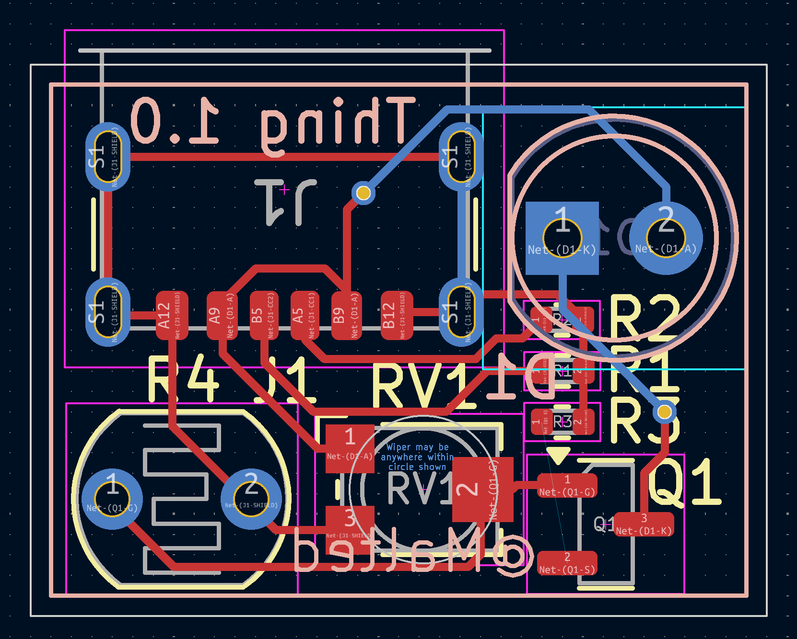
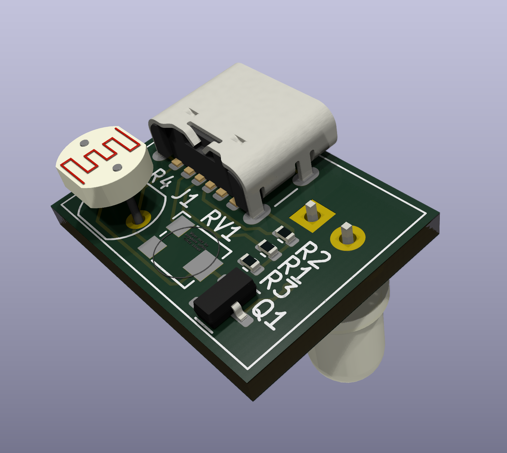

My subsystem is a nightlight that turns an LED on when an LDR (light-dependent resistor) detects it's dark. It's powered via a USB-C 5v rail.

When it's light, the resistance of the LDR is low, meaning the voltage at the base of the transistor is low, so the transistor is switched off, meaning the LED is not lit.
When it's dark, the resistance of the LDR is high, meaning the voltage at the base of the transistor is high, so the transistor switches on, allowing current to flow from the collector to emmitter, turning it on, allowing current to flow through the LED, through R<sub>3</sub> to ground, lighting it up.

---

Firstly, I need a power source. It's 2025, so I want to plug in a USB-C cable. I looked for a while and found this. It needs 2 5k1Ω resistors on the *CC* lines, which are for negotiating power. If you wanted to get serious you can negotiate up to like 20V and >3A IIRC but for this 5V is all I want. [A Hack Club alum—Hugo—made an amazing reference guide for USB-C power lines a couple of years ago](https://www.hugohu.me/media/USB-C.Primer.pdf), in which it says to use 5100Ω resistors on both CC1 and CC2 lines to be compatible with fancy USB-C cables and bricks. [Here's the 5k1Ω resistor I chose.](https://www.digikey.com/en/products/detail/yageo/RC0402FR-075K1L/726624), and here's the USB-C receptable I found! I wrote my thought process leading to finding this specific component at the bottom of the readme.

I searched for an LDR on Digikey and found the [PDV-P8103](https://www.digikey.com/en/products/detail/advanced-photonix/PDV-P8103/480610). Generic photoresistor. Great! According to the datasheet, is resistance is 0.5MΩ in the dark and 16k-33kΩ in the light.

> I originally tried to use an [NPN BJT](https://en.wikipedia.org/wiki/Bipolar_junction_transistor) (in writing this doc I kept typing NPM - the rot consumes) that looked good, but I found out that my base current would be too low to drive my LED because of the high voltage divider resistor values. I switched to a MOSFET.

I found a MOSFET on Digikey that has a footprint in Kicad; the [T2N7002AK](https://www.digikey.com/en/products/detail/toshiba-semiconductor-and-storage/T2N7002AK-LM/5298028). Looking at [the datasheet](https://toshiba.semicon-storage.com/info/docget.jsp?did=29712&prodName=T2N7002AK), we can tell V<sub>GSₜₕ</sub>—or the voltage drop between the gate and the source when the MOSFET switches—is between 1.1V and 2.1V. Normally, I would calculate the resistor value to be exactly correct. But since I can't know how bright users' rooms will be at night, I'm going to opt for a trimmer potentiometer so they can calibrate it themselves. 100kΩ max should be enough. The trimpot I'm going to use is the [TC33X-2-104E](https://www.digikey.com/en/products/detail/bourns-inc/TC33X-2-104E/612859).

Now let's calculate the value for R<sub>3</sub>. Without it, we'd be dumping ~5V across our little LED.

According to the MOSFET's datasheet, the drop across the drain and source (V<sub>DS</sub>) looks like ~100mV when I<sub>D</sub> is ~20mA and V<sub>GS</sub> is ~4V. The graph resolution down there is quite low so this is approximate but since it's proportionally such a small voltage it doesn't matter too much anyway.


I've selected a [nice little amber LED to use](https://www.mouser.com/datasheet/2/678/av02-1532en_ds_hlmp-wl02_2014-08-20-1827901.pdf). Nora said amber makes for a good nightlight colour. The datasheet says it has a 2.02V drop. So, combined with the MOSFET's V<sub>DS</sub>, the voltage our R<sub>3</sub> needs to drop is (5 - (2.02 + 0.1)) = 2.88V`.

Our LED datasheet says the LED should typically be operated between 10mA and 30mA, so let's pick 20mA. This means R<sub>3</sub> needs to be the following;

```
V = IR
2.88 = 0.02 * R
R = 2.88 / 0.02
R = 144
```

R<sub>3</sub> needs to be 144Ω. There's no 144Ω resistor in the [E24 series](https://asenergi.com/pdf/resistors/standard-resistor-values-e24.pdf) so I'll pick a 150Ω resistor which is close enough!

I'm picking a surface-mounted resistor with a power rating of 1/16W, which is less than what I could dump across a through-hole. Let's check to see if how I want to use it would be in spec. This can be checked with the power law.

```
P = IV
1/16 = 20mA * V
V = (1/16) / 0.02
V ‎ = 3.125
```

So, with the current load, the resistor can drop a max of 3.125V. This is okay, because in its current configuration it's only dropping 2.88V.

The total of my BoM is only ~$1.38 :) nice

> P.S. I'm pretty proud I got my pcb traced in a single layer! Routing everything again and again was very theraputic.




